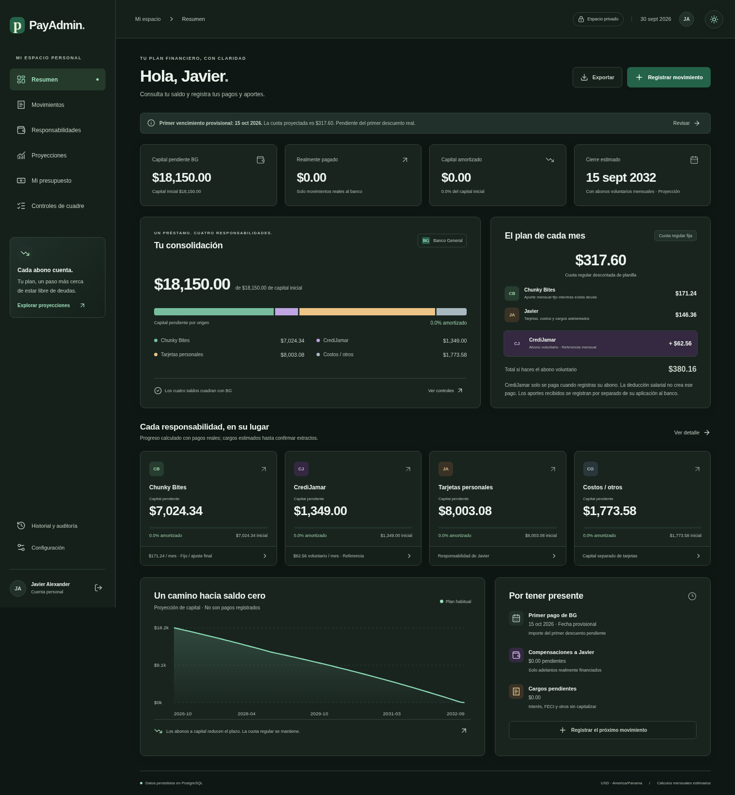

# PayAdmin

Aplicación privada en español para Javier Alexander Carrión Moreno. Next.js 16, TypeScript, PostgreSQL y cálculos con `decimal.js`. Un préstamo legal BG, cuatro responsabilidades internas, aportes separados de pagos bancarios y presupuesto de caja. Moneda USD; fechas y presupuesto en `America/Panama`.

**Estado:** aplicación y persistencia validadas con PostgreSQL local. El propietario confirmó el despliegue de Railway en línea. No se necesita la base remota para compilar ni ejecutar las pruebas financieras. Sin conexión configurada, la portada indica el pendiente y no expone información privada.

## Vista de la aplicación



[Vista móvil oscura](docs/prototype/iphone-dark.png) · [Formulario oscuro](docs/prototype/formulario-dark.png) · [Acceso oscuro](docs/prototype/login-dark.png) · [Vista clara](docs/prototype/desktop.png). Las capturas muestran la interfaz inicial, sin pagos registrados.

## Desarrollo

Requisitos: Node.js 24, npm y PostgreSQL 17 o posterior. Usa el checkout existente; las tareas en la nube ya están aisladas, no crees un worktree salvo que se solicite.

```sh
npm ci
cp .env.example .env.local
# Edita .env.local con la conexión del servidor y APP_URL.
npm run db:migrate
npm run user:create
npm run dev
```

`db:migrate` y `user:create` cargan `.env.local` si existe. Los valores inyectados por el servidor tienen prioridad. En Railway no es necesario crear un archivo de secretos.

### Crear el acceso privado

Puedes crear tu primer usuario desde el navegador, sin instalar herramientas ni abrir una terminal:

1. En Railway → servicio web PayAdmin → Variables, agrega `INITIAL_SETUP_TOKEN` con un código privado y aleatorio de 32 a 256 caracteres, sin espacios al principio o final. Elige tu propio valor; no uses ejemplos publicados ni lo compartas.
2. Aplica los cambios y despliega. Abre `/login` y pulsa **Crear mi cuenta**, o entra directamente a `/registro`.
3. Introduce ese código, tu correo y una contraseña nueva de 14 a 256 caracteres; confirma la contraseña. El código temporal es distinto de la contraseña de tu cuenta.
4. Inicia sesión. El registro se cierra automáticamente en cuanto existe un usuario, aunque la variable siga configurada.
5. Elimina `INITIAL_SETUP_TOKEN` de Railway y aplica los cambios. Tu cuenta sigue funcionando.

El código solo se valida en el servidor y no se envía a las páginas. Los intentos fallidos se limitan a diez cada quince minutos; la creación es transaccional, impide dos primeras cuentas simultáneas y registra auditoría sin contraseñas ni códigos. Sin el código configurado, o si ya hay usuarios, esta ruta no permite registrar cuentas. No permite recuperar ni reemplazar una cuenta existente.

[Formulario de registro](docs/prototype/registro.png) · [Registro en móvil](docs/prototype/registro-mobile.png).

La terminal sigue disponible como alternativa. Proporciona `ADMIN_EMAIL` y `ADMIN_PASSWORD` únicamente al comando de creación. La contraseña debe tener entre 14 y 256 caracteres. En una terminal Bash puedes introducirla sin mostrarla:

```sh
read -r -p 'Correo: ' ADMIN_EMAIL
read -r -s -p 'Contraseña: ' ADMIN_PASSWORD
export ADMIN_EMAIL ADMIN_PASSWORD
npm run user:create
unset ADMIN_EMAIL ADMIN_PASSWORD
```

El comando conserva usuarios existentes; no sobrescribe contraseñas. Elimina las variables de creación de cualquier configuración permanente. Las contraseñas se guardan como hashes scrypt con sal aleatoria; los tokens de sesión se guardan como SHA-256, con expiración a 14 días. Cookies HttpOnly, SameSite Strict y Secure en producción. Todas las lecturas privadas y escrituras requieren sesión; las escrituras también comprueban el origen exacto de `APP_URL`. El login limita intentos por cuenta y globalmente durante 15 minutos.

### Variables

| Variable                        | Uso                                                                                                                                                                                                  |
| ------------------------------- | ---------------------------------------------------------------------------------------------------------------------------------------------------------------------------------------------------- |
| `DATABASE_URL`                  | Conexión PostgreSQL del servidor; contiene credenciales, no debe ir a Git.                                                                                                                           |
| `APP_URL`                       | Origen exacto del sitio, por ejemplo el dominio HTTPS que Railway te asigne. Sin barra final es suficiente; se compara su origen.                                                                    |
| `COOKIE_SECURE`                 | `true` en Railway; `false` exclusivamente para HTTP local. Por defecto, Secure.                                                                                                                      |
| `DATABASE_SSL`                  | `disable` para conexiones privadas/locales que sirven PostgreSQL sin TLS; `verify` para TLS con verificación del certificado. Si la URL exige TLS y esta variable está ausente, se usa verificación. |
| `DATABASE_CA_FILE`              | Ruta opcional al certificado CA del proveedor para TLS verificable. No se desactiva la verificación.                                                                                                 |
| `PORT`                          | Railway lo inyecta; Next.js lo respeta. Localmente, 3000 por defecto.                                                                                                                                |
| `INITIAL_SETUP_TOKEN`           | Código temporal privado, de 32 a 256 caracteres, para crear únicamente la primera cuenta desde `/registro`. Eliminarlo después de crearla.                                                           |
| `ADMIN_EMAIL`, `ADMIN_PASSWORD` | Solo al crear el usuario mediante terminal; no hacen falta para ejecutar la aplicación.                                                                                                              |

## Railway: configuración

1. Conecta este repositorio a un servicio Railway y añade un servicio PostgreSQL.
2. En el servicio web configura `DATABASE_URL` como referencia a la conexión **privada** del servicio PostgreSQL. No copies credenciales al código. Si usas un endpoint TLS público, configura `DATABASE_SSL=verify` y la CA correspondiente.
3. Genera el dominio del servicio web y configura `APP_URL` con su origen HTTPS. Establece `COOKIE_SECURE=true`.
4. `railway.json` usa el Dockerfile, ejecuta `npm run db:migrate` antes del despliegue y arranca con `npm run start`. `/api/health` comprueba la base y el esquema; responde 503 hasta que estén disponibles. El healthcheck no revela datos financieros.
5. Crea tu acceso desde `/registro` usando `INITIAL_SETUP_TOKEN`, siguiendo los pasos anteriores. Como alternativa, ejecuta una vez `npm run user:create` **en el entorno que tiene acceso a la base privada**, con las dos variables temporales. Una ejecución local de `railway run` puede no alcanzar el hostname privado: usa la consola/shell del servicio o un endpoint verificado accesible.
6. Inicia sesión y confirma los cuadres iniciales, la fecha provisional y cero movimientos del préstamo nuevo. Habilita copias de seguridad de PostgreSQL en Railway.

El Dockerfile compila sin credenciales de base de datos. La migración es transaccional, idempotente y protegida por un bloqueo para despliegues simultáneos. Incluye datos iniciales reales de la cotización, composición y el historial separado del préstamo anterior de Chunky. **No incluye pagos de prueba del préstamo nuevo.**

## Uso

La aplicación abre en modo oscuro. El botón de sol o luna de la esquina superior derecha cambia entre oscuro y claro y conserva la elección en el navegador. Se aplica al resumen, tablas, gráficas, formularios, login y registro. La preferencia no guarda datos financieros.

- **Resumen:** capital, pagos reales, progreso por capital y composición pendiente de las cuatro bolsas respecto al capital inicial BG.
- **Movimientos:** pagos reales, aportes recibidos y caja en listas separadas. Vínculos de aporte a pago con importes explícitos, sin doble registro. Permite varios pagos quincenales y correcciones/anulaciones con motivo, versión y auditoría.
- **Responsabilidades:** saldos, cargos pagados y pendientes, calendario interno mensual, plazos y composición. Los cargos CrediJamar financiados por Javier y sus compensaciones se ven en Movimientos.
- **Proyecciones:** escenarios regular, habitual y trayectoria actual, simulador de extras dirigidos y efecto del último abono. Ninguna simulación crea un pago real.
- **Presupuesto:** salario antes/después de descuento configurable; quincenas, caja efectiva registrada, aportes pendientes, gastos y ahorro líquido. La planilla de caja se ingresa **neta**. La caja se agrupa por la fecha efectiva; los aportes esperados se comparan por su período de responsabilidad. Los descuentos BG regulares ya están incluidos en ella y no se restan otra vez; los extras se restan como salidas bancarias. El resultado es cambio de caja registrado, sin inventar saldo inicial en efectivo.
- **Mis gastos:** define compromisos fijos mensuales con importe, vencimiento y mes de vigencia; registra pagos completos o parciales, gastos personales y salidas de ahorro. Los fijos reservan Necesidades (50%); Personal usa Gustos (30%); Ahorro/deuda (20%) descuenta la carga personal BG, los abonos voluntarios reales y el ahorro apartado. El disponible se comparte con Mi presupuesto. Los excesos se permiten y se muestran como alertas. Las versiones mensuales permiten editar o desactivar un fijo desde un mes sin alterar su configuración anterior. Cada pago es un único registro de caja y admite corrección/anulación con auditoría.
- **Ahorro acumulado:** apartar dinero (`SAVING`) sale de caja y consume la asignación de ahorro/deuda. Un gasto con origen «Ahorros acumulados» reduce solo ese ahorro, sin duplicar salida de caja ni consumir otra vez la asignación mensual. «Ahorro del mes» con origen caja sí consume la asignación del mes. «Saldo previo de ahorro» (`SAVINGS_OPENING`) incorpora fondos que ya existían fuera de caja; no es ingreso salarial ni ahorro apartado este mes. Solo se muestran saldos registrados, sin inventar uno inicial. Caja se calcula por fecha efectiva; cumplimiento de un fijo se calcula por mes asignado, incluso si se paga antes o después.
- **Controles:** 17 comprobaciones con estados correcto, diferencia y pendiente; extractos con cero confirmado distinto de desconocido. Las diferencias bancarias no generan ajustes.
- **Configuración:** parámetros con vigencia y reparto compartido de CrediJamar sin presuponer 50/50. Antes de pagos/extractos se pueden corregir las hipótesis iniciales; después, las nuevas versiones rigen en meses futuros sin movimientos. Los meses previos se conservan. El día del primer vencimiento provisional puede confirmarse en su formulario específico incluso después de pagar, con auditoría y conservando el mes de inicio; no cambia las fechas reales de pagos ni las tasas/cuotas históricas.
- **Historial:** préstamo anterior de Chunky, diferencia desconocida de $67.85 y auditoría de los últimos 100 cambios. Los datos antes/después permanecen completos en PostgreSQL.
- **Exportación CSV:** movimientos, aportes, caja, asignaciones, resultados mensuales y calendario proyectado. Importable en Excel, con protección frente a fórmulas introducidas en textos.

La aplicación incluye manifest, iconos y service worker para agregarla a la pantalla de inicio. En iPhone: Compartir → Agregar a inicio. **Necesita Internet**: no guarda páginas privadas ni respuestas financieras en caché offline.

## Hipótesis financieras verificables

1. Capital inicial $18,150.00 = $16,376.42 de deudas + $1,428.85 de gastos + $317.60 de interés cotizado financiado + $27.13 de efectivo. El interés cotizado **no es un pago histórico**. El efectivo recibido **no es gasto**.
2. Fecha inicial provisional 15/10/2026, primer importe real desconocido. Las fechas registradas documentan pagos; el cálculo estima períodos mensuales completos, no días contractuales.
3. Interés legal mensual = capital inicial del período × 9.50% / 12; FECI = capital × 1% / 12. Se calculan una sola vez. El 11.72% reportado se conserva como dato, no se usa para inventar cargos.
4. Se calculan los devengos con decimal de 40 dígitos y se redondean a centavos (mitades hacia arriba). La atribución a las cuatro bolsas distribuye centavos por mayores residuos, con desempate estable Chunky, CrediJamar, tarjetas y costos. Se conserva exactamente el importe legal. La referencia aislada CrediJamar mantiene precisión completa, por eso puede diferir algunos centavos de su calendario atribuido dentro de BG.
5. Cuota regular inicial $317.60: Chunky $171.24, Javier $146.36. No es una distribución proporcional de la cuota. La parte de capital regular de Javier se distribuye entre tarjetas y costos según sus saldos. Un pago parcial asigna una parte equivalente del flujo fijo; el devengo mensual ocurre una vez aunque haya dos descuentos. Se informan los cargos y faltantes efectivos.
6. Convención de aplicación, pendiente de confirmar contractualmente: interés pendiente y actual, FECI, otros cargos explícitos, y capital. Cargos no cubiertos quedan pendientes y no se capitalizan. Si la parte efectiva de un pago parcial no cubre cargos, no se registra capital ficticio ni cuota completa pagada.
7. Todos los pagos CrediJamar son **voluntarios y se aplican únicamente cuando el propietario los registra**, con su fecha e importe reales. Registrar la deducción salarial no crea un pago CrediJamar ni reduce su capital. $62.56 es una referencia mensual para el escenario de proyección, no una deducción automática ni un pago real. Sus cargos pagados realmente con la cuota regular crean un adelanto a Javier. Un movimiento **Abono voluntario CrediJamar** reduce capital legal: primero reduce capital personal por la compensación de ese adelanto, luego capital CrediJamar. La compensación se guarda explícitamente y no paga intereses bancarios dos veces. Si el abono llega antes de que los cargos hayan sido financiados, solo compensa adelantos existentes; el resto reduce capital CrediJamar y sus cargos quedan pendientes con advertencia. Un **Extra a capital CrediJamar** es una aplicación directa al capital de esa fuente, sin compensación. Registrar un aporte recibido sin aplicación no cambia ninguno de esos saldos.
8. Extras dirigidos reducen únicamente su fuente. Nunca exceden su capital. El exceso queda explicado como dinero sin aplicar; corrige/divide el movimiento con destinos explícitos o documenta su devolución. No se reasigna automáticamente.
9. Chunky tiene límite 02/06/2031, sin cinco años adicionales desde la consolidación. CrediJamar tiene 24 meses desde el inicio. La proyección ajusta el último pago a la deuda; en CrediJamar el ajuste automático al mes 24 se limita a cinco centavos sobre la cuota propuesta, para no ocultar impagos mediante un pago final grande. Cualquier faltante mayor dispara el error del límite. Se muestra el faltante y un extra dirigido estimado por búsqueda numérica; cargos/adelantos pendientes siguen separados. Un pago posterior al límite no borra el incumplimiento histórico.
10. Comparación aislada CrediJamar: cuota exacta $62.56128017, total $1,501.47, cargos $152.47, última cuota aislada $62.59. Original aproximado $2,328.00, costo financiero implícito estimado $979.00; diferencia estimada $826.53, exclusivamente sobre $1,349 a 24 meses.
11. Cuota matemática BG a 84 meses ≈ $306.02; cuota oficial $317.60; base legal simulada ≈ 80 pagos. La diferencia inicial no cuenta como ahorro por abonos. El escenario bancario solo regular paga todo el capital legal, sin presentar un reparto interno CrediJamar a 80 meses como autorizado.
12. Para impactos individuales se mantienen iguales los pagos regulares y la programación **bancaria** futura de CrediJamar en ambos contrafactuales. Si la simulación adelanta el cierre interno de CrediJamar, mantener esas futuras entradas bancarias es una hipótesis de comparación, no una autorización para cobrar/reasignar aportes reales tras su liquidación. El ahorro acumulado compara trayectorias completas y separa CrediJamar de extras voluntarios, sin sumar ahorros individuales superpuestos ni capital aportado.
13. Los extractos reemplazan solo devengos conocidos; vacío = desconocido, cero = confirmado. Capital amortizado y saldo reportado son controles de diferencia, no sustituciones del cálculo. En el historial contrafactual se conservan los mismos devengos confirmados; los cargos futuros vuelven a estimarse sobre los saldos de cada escenario.
14. Un período sin registro es desconocido. «Sin pago confirmado» es explícito y no puede coexistir con pagos en ese mes hasta corregir/anular la confirmación.
15. El cierre real de cada fuente requiere capital y cargos saldados (y compensación CrediJamar resuelta). Las barras miden solamente capital amortizado / capital inicial; no incluyen intereses ni pagos históricos anteriores.
16. Si BG se cancela antes de resolver los adelantos de Javier, Movimientos → Aportes permite aplicar un reembolso CrediJamar recibido después de la cancelación. Se vincula a un aporte real y no crea otro ingreso ni pago bancario. Tiene idempotencia, corrección, anulación, auditoría y CSV; no se puede reutilizar dinero ya vinculado. Para reabrir el préstamo por una corrección, primero se anula esa aplicación. Un adelanto interno pendiente sigue visible aunque el saldo bancario sea cero.

El esquema guarda `NUMERIC`, parámetros por vigencia, aportes, vínculos, pagos, extractos, asignaciones, compensaciones, resultados mensuales, caja y auditoría. Las operaciones se serializan mediante un bloqueo transaccional; las correcciones validan revisión y recalculan desde el inicio, manteniendo el antes/después del cambio.

## Validación

```sh
npm test
npm run typecheck
npm run build
```

Para integración usa **una base independiente cuyo nombre termine en `_test`**, previamente migrada. La prueba limpia tablas de movimientos de esa base y nunca debe apuntar a la base personal.

```sh
DATABASE_URL='conexión-de-la-base-test' npm run db:migrate
# Arranca un servidor local de la aplicación para las comprobaciones HTTP.
DATABASE_URL='conexión-de-la-base-test' TEST_BASE_URL='origen-del-servidor-local' npm run test:integration
```

Las pruebas financieras cubren cuadres, flujo fijo, compensación, límites, extras $200/$1,000/$500, pagos cero/parciales/quincenales, ceros confirmados, exceso, barras por capital y versiones futuras. La integración comprueba PostgreSQL NUMERIC, aportes no aplicados, concurrencia/idempotencia, vínculos, correcciones, anulaciones, extractos y rechazo de solicitudes sin autenticación o con origen ajeno. También verifica registro inicial deshabilitado, código incorrecto, límite persistente de intentos, creación simultánea de una sola cuenta y cierre automático. Los archivos de integración se ejecutan en serie porque comparten la base test.

Las capturas locales se generan con `scripts/capture-prototype.ts` usando una BD `_dev` o `_test`, Chromium instalado y el servidor local. Crea y elimina un usuario temporal; no registra pagos ni ofrece una ruta pública de demostración. Archivos en `.local/prototype/`.

`DATABASE_URL` de la base `_test` y `TEST_BASE_URL` de un servidor que use esa misma base permiten ejecutar `npx tsx scripts/test-browser.ts`. Esa prueba verifica los formularios en Chromium, incluyendo pagos vinculados, corrección, extracto cero y presupuesto, y limpia/restaura su estado temporal al terminar. No la ejecutes sobre la base personal.

`npx tsx scripts/test-registration.ts` verifica el registro inicial en escritorio y móvil, el código privado, la confirmación, el origen de la solicitud, el cierre del registro y el login. Requiere una base `_test` sin usuarios, `TEST_BASE_URL` y el mismo `INITIAL_SETUP_TOKEN` temporal en el servidor y la prueba. Elimina únicamente la cuenta temporal que crea. No utiliza la base personal.

`npx tsx scripts/test-theme.ts` verifica ambos temas, contraste de texto, persistencia, sincronización entre pestañas, formularios y móvil. Usa una base aislada `_dev` o `_test` y `TEST_BASE_URL`; crea y elimina una cuenta temporal sin registrar pagos.

`npx tsx scripts/test-expenses.ts` verifica gastos fijos, pagos parciales, corrección/anulación, gastos personales, ahorro previo/apartado/gastado, alertas de sobregiro, persistencia y caja compartida, ambos temas y móvil. Requiere una BD `_test` sin movimientos y un servidor que use esa misma base (`TEST_BASE_URL`). Crea datos identificados como prueba y los elimina al terminar; las capturas en `.local/prototype/` son ejemplos, no movimientos personales. La migración `004_expenses.sql` se aplica automáticamente con el comando de predeploy existente `npm run db:migrate`.

La conexión remota, publicación, persistencia entre despliegues Railway y metodología contractual del banco se verificarán cuando estén disponibles. La validación local no afirma que esos pasos ya ocurrieron.
